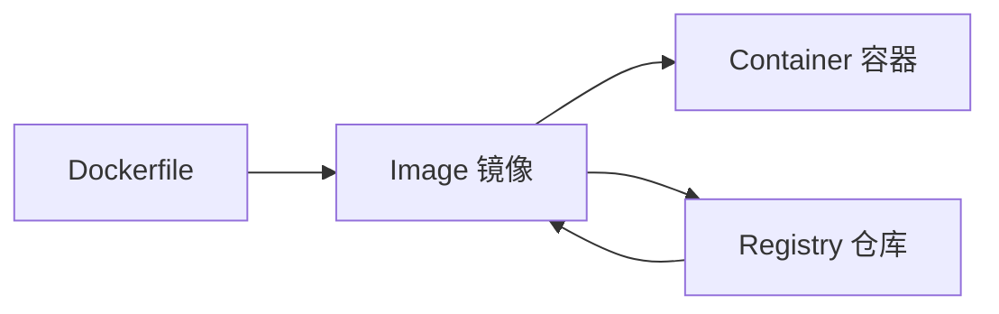
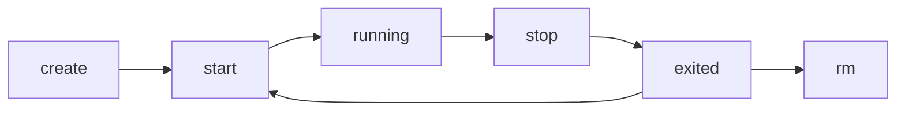

# Docker 系统学习文档（含习题）

> 适合：想系统学习 Docker 的初学者 / 有 Linux 基础但没形成知识体系的人  
> 学习目标：从“会用命令”提升到“能独立构建、部署、排障 Docker 项目”  
> 建议环境：Ubuntu / WSL2 / macOS / Windows + Docker Desktop  
> 学习方式：概念 + 命令 + 实战 + 习题

---

## 目录

- [1. Docker 是什么](#1-docker-是什么)
- [2. 为什么要学 Docker](#2-为什么要学-docker)
- [3. Docker 核心概念](#3-docker-核心概念)
- [4. Docker 安装与环境验证](#4-docker-安装与环境验证)
- [5. 第一次运行 Docker](#5-第一次运行-docker)
- [6. 镜像 Image 系统学习](#6-镜像-image-系统学习)
- [7. 容器 Container 系统学习](#7-容器-container-系统学习)
- [8. 数据卷 Volume 与数据持久化](#8-数据卷-volume-与数据持久化)
- [9. Docker 网络 Network](#9-docker-网络-network)
- [10. Dockerfile：自己构建镜像](#10-dockerfile自己构建镜像)
- [11. Docker Compose：多容器编排](#11-docker-compose多容器编排)
- [12. Docker 日志、调试与排障](#12-docker-日志调试与排障)
- [13. Docker 常见最佳实践](#13-docker-常见最佳实践)
- [14. Docker 底层原理速通](#14-docker-底层原理速通)
- [15. 综合实战：部署一个前后端分离应用](#15-综合实战部署一个前后端分离应用)
- [16. 14 天 Docker 学习路线](#16-14-天-docker-学习路线)
- [17. 分章节习题](#17-分章节习题)
- [18. 综合练习题](#18-综合练习题)
- [19. 参考答案要点](#19-参考答案要点)

---

# 1. Docker 是什么

Docker 是一种**容器化平台**。  
它可以把应用程序、运行环境、依赖库、配置文件一起打包，让应用在不同机器上以一致的方式运行。

你可以把 Docker 理解成：

- **镜像（Image）**：应用模板
- **容器（Container）**：镜像运行后的实例
- **仓库（Registry）**：存放镜像的地方，比如 Docker Hub

Docker 的核心价值不只是“能跑程序”，而是：

- 环境一致
- 部署快捷
- 隔离性好
- 易于迁移
- 便于 CI/CD 和微服务部署

---

# 2. 为什么要学 Docker

在真实开发中，最常见的问题之一就是：

> “我电脑上能跑，为什么你电脑上不行？”

Docker 解决的就是这类环境不一致问题。

## 2.1 Docker 的典型使用场景

- 快速搭建开发环境  
  例如：MySQL、Redis、Nginx、PostgreSQL、MongoDB
- 项目部署
- 微服务部署
- 测试环境隔离
- CI/CD 自动化构建
- 临时运行工具链
- 同一台机器运行多个版本的软件

## 2.2 Docker 和虚拟机的区别

| 对比项 | Docker 容器 | 虚拟机 |
|---|---|---|
| 启动速度 | 秒级 | 分钟级 |
| 资源占用 | 小 | 大 |
| 隔离级别 | 进程级隔离 | 硬件级虚拟化 |
| 运行方式 | 共享宿主机内核 | 每个虚拟机有独立 OS |
| 适合场景 | 应用部署、开发环境、微服务 | 强隔离、多操作系统 |

## 2.3 一个直观理解

- 虚拟机：像“每个应用带一套完整房子”
- 容器：像“每个应用住在独立房间，共享楼体”

---

# 3. Docker 核心概念

## 3.1 镜像 Image

镜像是只读模板，用来创建容器。  
类似于：

- 类和对象中的“类”
- 操作系统中的“安装包模板”

一个镜像里通常包含：

- 基础系统环境
- 运行时
- 应用代码
- 配置
- 启动命令

## 3.2 容器 Container

容器是镜像的运行实例。  
同一个镜像可以启动多个容器。

例如：

- 一个 `nginx` 镜像
- 可以启动多个 Nginx 容器实例

## 3.3 仓库 Registry

仓库用于存储镜像。

常见仓库：

- Docker Hub
- 阿里云镜像仓库
- 腾讯云镜像仓库
- Harbor（私有仓库）

## 3.4 Docker Engine

Docker Engine 是 Docker 的运行引擎，主要包括：

- Docker Daemon：后台服务
- Docker CLI：命令行工具
- REST API：程序接口

## 3.5 三者关系



---

# 4. Docker 安装与环境验证

> 这里不展开不同系统的安装细节，重点讲安装后如何验证环境是否正常。

## 4.1 安装后检查版本

```bash
docker --version
docker compose version
```

## 4.2 查看 Docker 信息

```bash
docker info
```

## 4.3 验证服务是否正常

```bash
docker run hello-world
```

如果正常，会看到 Docker 下载镜像并输出一段欢迎信息。

## 4.4 Linux 下常见权限问题

如果执行 Docker 命令提示权限不足：

```bash
permission denied while trying to connect to the Docker daemon socket
```

可将当前用户加入 docker 组：

```bash
sudo usermod -aG docker $USER
newgrp docker
```

---

# 5. 第一次运行 Docker

## 5.1 拉取一个镜像

```bash
docker pull nginx
```

## 5.2 查看本地镜像

```bash
docker images
```

## 5.3 启动一个 Nginx 容器

```bash
docker run -d --name mynginx -p 8080:80 nginx
```

参数解释：

- `-d`：后台运行
- `--name mynginx`：容器命名
- `-p 8080:80`：宿主机 8080 映射到容器 80 端口

## 5.4 查看运行中的容器

```bash
docker ps
```

## 5.5 查看所有容器

```bash
docker ps -a
```

## 5.6 停止容器

```bash
docker stop mynginx
```

## 5.7 启动已停止的容器

```bash
docker start mynginx
```

## 5.8 删除容器

```bash
docker rm mynginx
```

如果容器还在运行，要先停止，或者强制删除：

```bash
docker rm -f mynginx
```

---

# 6. 镜像 Image 系统学习

镜像是 Docker 学习的核心之一。

## 6.1 查看本地镜像

```bash
docker images
```

## 6.2 拉取指定版本镜像

```bash
docker pull redis:7
docker pull mysql:8.0
```

不写标签默认是 `latest`，但生产环境中**不建议依赖 latest**。

## 6.3 镜像命名规则

通常形式：

```text
仓库名/镜像名:标签
```

例如：

```text
nginx:1.27
redis:7
mysql:8.0
```

## 6.4 删除镜像

```bash
docker rmi nginx
```

如果镜像被容器使用，需要先删除相关容器。

## 6.5 搜索镜像

```bash
docker search nginx
```

## 6.6 镜像分层思想

Docker 镜像是分层构建的。

例如：

- 基础层：Ubuntu
- 安装 Python
- 拷贝代码
- 安装依赖
- 设置启动命令

这样做的好处：

- 节省存储空间
- 复用缓存
- 构建更快

## 6.7 查看镜像历史

```bash
docker history nginx
```

可以看到镜像是如何一层层构建出来的。

## 6.8 导出与导入镜像

导出：

```bash
docker save -o nginx.tar nginx:latest
```

导入：

```bash
docker load -i nginx.tar
```

适用于离线环境。

---

# 7. 容器 Container 系统学习

## 7.1 创建并运行容器

```bash
docker run -it ubuntu bash
```

参数解释：

- `-i`：保持标准输入
- `-t`：分配终端
- `ubuntu`：镜像名
- `bash`：启动命令

## 7.2 后台运行

```bash
docker run -d --name redis-test redis:7
```

## 7.3 查看容器日志

```bash
docker logs redis-test
docker logs -f redis-test
```

## 7.4 进入容器内部

```bash
docker exec -it redis-test bash
```

有些镜像没有 `bash`，可以换成：

```bash
docker exec -it redis-test sh
```

## 7.5 查看容器详细信息

```bash
docker inspect redis-test
```

## 7.6 查看容器资源使用

```bash
docker stats
```

## 7.7 容器重命名

```bash
docker rename redis-test redis-dev
```

## 7.8 容器自动重启策略

```bash
docker run -d --restart unless-stopped nginx
```

常见策略：

- `no`
- `always`
- `on-failure`
- `unless-stopped`

## 7.9 容器生命周期



---

# 8. 数据卷 Volume 与数据持久化

容器删除后，容器内的数据默认也会丢失。  
所以需要数据持久化。

Docker 常见持久化方式：

- Volume（推荐）
- Bind Mount（宿主机目录挂载）

## 8.1 为什么需要持久化

例如 MySQL 容器：

- 数据库存储在容器里
- 一旦删容器，数据就没了

因此应把数据挂载到外部。

## 8.2 创建数据卷

```bash
docker volume create mydata
```

查看：

```bash
docker volume ls
```

## 8.3 使用数据卷

```bash
docker run -d \
  --name nginx-volume \
  -p 8081:80 \
  -v mydata:/usr/share/nginx/html \
  nginx
```

## 8.4 绑定宿主机目录

```bash
docker run -d \
  --name nginx-bind \
  -p 8082:80 \
  -v /home/user/html:/usr/share/nginx/html \
  nginx
```

## 8.5 两者区别

| 方式 | 特点 |
|---|---|
| Volume | Docker 管理，适合生产和规范化使用 |
| Bind Mount | 直接映射宿主机目录，适合开发调试 |

## 8.6 查看卷详细信息

```bash
docker volume inspect mydata
```

## 8.7 删除数据卷

```bash
docker volume rm mydata
```

注意：卷正在被容器使用时不能删除。

---

# 9. Docker 网络 Network

Docker 容器之间通信依赖网络。

## 9.1 默认网络模式

常见网络模式：

- bridge
- host
- none

## 9.2 查看网络

```bash
docker network ls
```

## 9.3 bridge 模式

默认模式。  
容器会连接到一个桥接网络中，可以通过 IP 或容器名通信。

## 9.4 创建自定义网络

```bash
docker network create app-net
```

## 9.5 让容器加入网络

```bash
docker run -d --name mysql-dev --network app-net mysql:8.0
docker run -d --name backend-dev --network app-net my-backend:latest
```

这样 `backend-dev` 可以直接通过 `mysql-dev` 访问 MySQL。

## 9.6 查看网络详情

```bash
docker network inspect app-net
```

## 9.7 删除网络

```bash
docker network rm app-net
```

## 9.8 为什么自定义网络很重要

在多容器项目中：

- 前端要访问后端
- 后端要访问数据库
- Redis 要给业务服务使用

通过自定义网络，可以让容器之间通过**服务名**通信，而不是手动写 IP。

---

# 10. Dockerfile：自己构建镜像

真正进入实战后，不能只会拉官方镜像，还要会自己打包应用。

## 10.1 Dockerfile 是什么

Dockerfile 是一个文本文件，用来描述如何构建镜像。

## 10.2 一个最简单的 Python 示例

项目结构：

```text
demo-app/
├── app.py
├── requirements.txt
└── Dockerfile
```

### app.py

```python
from flask import Flask
app = Flask(__name__)

@app.route("/")
def hello():
    return "Hello Docker!"

if __name__ == "__main__":
    app.run(host="0.0.0.0", port=5000)
```

### requirements.txt

```text
flask==3.0.0
```

### Dockerfile

```dockerfile
FROM python:3.11-slim

WORKDIR /app

COPY requirements.txt .

RUN pip install --no-cache-dir -r requirements.txt

COPY . .

EXPOSE 5000

CMD ["python", "app.py"]
```

## 10.3 构建镜像

```bash
docker build -t my-flask-app:1.0 .
```

## 10.4 运行镜像

```bash
docker run -d --name flask-demo -p 5000:5000 my-flask-app:1.0
```

## 10.5 Dockerfile 常用指令

### FROM

指定基础镜像

```dockerfile
FROM ubuntu:22.04
```

### WORKDIR

设置工作目录

```dockerfile
WORKDIR /app
```

### COPY

复制文件到镜像中

```dockerfile
COPY . .
```

### RUN

构建时执行命令

```dockerfile
RUN apt-get update && apt-get install -y curl
```

### CMD

容器启动时默认执行命令

```dockerfile
CMD ["python", "app.py"]
```

### ENTRYPOINT

定义固定入口命令

### EXPOSE

声明容器暴露端口

### ENV

设置环境变量

```dockerfile
ENV APP_ENV=production
```

## 10.6 CMD 和 RUN 的区别

- `RUN`：构建镜像时执行
- `CMD`：启动容器时执行

## 10.7 优化 Dockerfile 的常见思路

- 选择更小的基础镜像
- 合并层数
- 善用缓存
- 先复制依赖文件，再安装依赖
- 使用 `.dockerignore`

## 10.8 .dockerignore 示例

```text
.git
__pycache__
node_modules
*.log
.env
```

---

# 11. Docker Compose：多容器编排

当项目里有多个服务时，单独一个个 `docker run` 会很难管理。  
这时就需要 Docker Compose。

## 11.1 Compose 的作用

使用一个 `compose.yaml` 文件，统一定义：

- 服务
- 镜像
- 端口
- 环境变量
- 数据卷
- 网络
- 启动顺序

## 11.2 一个简单示例

```yaml
services:
  web:
    image: nginx:latest
    ports:
      - "8080:80"

  redis:
    image: redis:7
```

启动：

```bash
docker compose up -d
```

停止：

```bash
docker compose down
```

## 11.3 一个更接近真实项目的示例

```yaml
services:
  backend:
    build: ./backend
    container_name: backend-app
    ports:
      - "5000:5000"
    environment:
      - DB_HOST=mysql
      - DB_PORT=3306
      - DB_USER=root
      - DB_PASSWORD=123456
    depends_on:
      - mysql
    networks:
      - app-net

  mysql:
    image: mysql:8.0
    container_name: mysql-db
    environment:
      MYSQL_ROOT_PASSWORD: 123456
      MYSQL_DATABASE: appdb
    ports:
      - "3306:3306"
    volumes:
      - mysql-data:/var/lib/mysql
    networks:
      - app-net

volumes:
  mysql-data:

networks:
  app-net:
```

## 11.4 常见命令

启动：

```bash
docker compose up -d
```

查看服务：

```bash
docker compose ps
```

查看日志：

```bash
docker compose logs
docker compose logs -f backend
```

停止并删除：

```bash
docker compose down
```

重新构建启动：

```bash
docker compose up -d --build
```

## 11.5 Compose 的价值

- 管理多服务更清晰
- 便于团队协作
- 配置可版本管理
- 适合本地开发环境和小型部署

---

# 12. Docker 日志、调试与排障

很多人会“运行 Docker”，但不会“排查 Docker 问题”。  
这部分非常重要。

## 12.1 容器启动失败先看什么

第一步：

```bash
docker ps -a
```

看容器状态是否退出。

第二步：

```bash
docker logs 容器名
```

## 12.2 常见问题 1：端口冲突

报错类似：

```text
bind: address already in use
```

说明宿主机端口被占用。

解决：

- 换端口
- 停掉占用该端口的程序

## 12.3 常见问题 2：容器反复退出

可能原因：

- 启动命令写错
- 程序崩溃
- 依赖服务未准备好
- 环境变量缺失

排查：

```bash
docker logs 容器名
docker inspect 容器名
```

## 12.4 常见问题 3：容器内命令不存在

例如：

```text
bash: not found
```

说明镜像里没有 bash，可用：

```bash
docker exec -it 容器名 sh
```

## 12.5 常见问题 4：数据没保存

可能你只是把文件写进了容器，但没有挂载 volume。

## 12.6 常见问题 5：容器间无法通信

排查点：

- 是否在同一网络
- 访问地址是否写成服务名
- 端口是否写对
- 服务是否已启动

## 12.7 调试常用命令汇总

```bash
docker ps -a
docker logs 容器名
docker inspect 容器名
docker exec -it 容器名 sh
docker stats
docker network ls
docker network inspect 网络名
docker volume ls
```

---

# 13. Docker 常见最佳实践

## 13.1 不要总用 latest

推荐显式版本号：

```text
nginx:1.27
mysql:8.0
redis:7
```

## 13.2 容器尽量单一职责

一个容器最好只运行一个主服务。  
例如：

- 一个容器跑 Nginx
- 一个容器跑 MySQL
- 一个容器跑后端

## 13.3 数据要持久化

数据库、上传文件、缓存目录等要明确挂载。

## 13.4 敏感配置不要写死在镜像里

例如：

- 数据库密码
- API Key
- Token

推荐使用：

- 环境变量
- `.env`
- secrets 管理机制

## 13.5 使用 `.dockerignore`

减少构建上下文，提高构建速度，避免无关文件进入镜像。

## 13.6 减少镜像体积

- 用 `alpine` 或 `slim`
- 删除不必要依赖
- 合并 RUN 层
- 多阶段构建

## 13.7 使用非 root 用户运行应用

提升安全性。

## 13.8 配置健康检查

让容器状态更可观测。

---

# 14. Docker 底层原理速通

面试或深入学习时，必须知道 Docker 不只是命令行工具。

## 14.1 Docker 为什么轻量

因为容器**共享宿主机内核**，不像虚拟机那样要完整模拟一套操作系统。

## 14.2 Docker 隔离依赖什么

Linux 中主要依赖：

- Namespace：资源隔离
- Cgroups：资源限制
- Union File System：分层文件系统

## 14.3 Namespace 做了什么

让不同容器看到不同的：

- 进程空间
- 网络空间
- 挂载点
- 主机名
- 用户视图

## 14.4 Cgroups 做了什么

限制容器的：

- CPU
- 内存
- IO 等资源使用

## 14.5 分层文件系统

Docker 镜像一层层叠加：

- 基础镜像层
- 依赖安装层
- 应用代码层
- 容器运行时可写层

这也是为什么镜像可以缓存、复用。

---

# 15. 综合实战：部署一个前后端分离应用

这里给你一个典型多服务项目案例：

- 前端：Nginx
- 后端：Flask
- 数据库：MySQL
- 缓存：Redis

## 15.1 项目结构示意

```text
project/
├── backend/
│   ├── app.py
│   ├── requirements.txt
│   └── Dockerfile
├── frontend/
│   └── dist/
├── compose.yaml
└── nginx.conf
```

## 15.2 后端 Dockerfile

```dockerfile
FROM python:3.11-slim

WORKDIR /app

COPY requirements.txt .
RUN pip install --no-cache-dir -r requirements.txt

COPY . .

EXPOSE 5000

CMD ["python", "app.py"]
```

## 15.3 compose.yaml 示例

```yaml
services:
  backend:
    build: ./backend
    container_name: backend-service
    ports:
      - "5000:5000"
    environment:
      - DB_HOST=mysql
      - DB_PORT=3306
      - DB_USER=root
      - DB_PASSWORD=123456
      - REDIS_HOST=redis
    depends_on:
      - mysql
      - redis
    networks:
      - app-net

  mysql:
    image: mysql:8.0
    container_name: mysql-service
    environment:
      MYSQL_ROOT_PASSWORD: 123456
      MYSQL_DATABASE: appdb
    ports:
      - "3306:3306"
    volumes:
      - mysql-data:/var/lib/mysql
    networks:
      - app-net

  redis:
    image: redis:7
    container_name: redis-service
    ports:
      - "6379:6379"
    networks:
      - app-net

  nginx:
    image: nginx:latest
    container_name: nginx-service
    ports:
      - "8080:80"
    volumes:
      - ./frontend/dist:/usr/share/nginx/html
      - ./nginx.conf:/etc/nginx/conf.d/default.conf
    depends_on:
      - backend
    networks:
      - app-net

volumes:
  mysql-data:

networks:
  app-net:
```

## 15.4 启动项目

```bash
docker compose up -d --build
```

## 15.5 验证顺序

1. 查看容器是否全部启动
2. 查看后端日志
3. 查看数据库是否初始化成功
4. 浏览器访问前端
5. 检查前后端接口连通性

## 15.6 这个案例锻炼了什么

- 自定义镜像构建
- 多服务编排
- 网络通信
- 数据持久化
- 依赖关系管理
- 真实部署思维

---

# 16. 14 天 Docker 学习路线

## Day 1：认识 Docker
- Docker 是什么
- 容器和虚拟机区别
- 镜像、容器、仓库概念

## Day 2：安装 Docker
- 安装 Docker
- 跑通 hello-world
- 学会查看版本、服务状态

## Day 3：镜像基础
- pull / images / rmi / history
- 理解镜像标签和分层

## Day 4：容器基础
- run / ps / stop / start / rm
- logs / exec / inspect

## Day 5：Nginx 实战
- 跑一个 Nginx
- 配端口映射
- 改静态页面

## Day 6：Volume 持久化
- volume create
- bind mount
- 理解数据为什么不能只放容器里

## Day 7：网络
- 网络模式
- 自定义网络
- 容器互联

## Day 8：Dockerfile 入门
- 自己打包一个 Python/Node 应用
- 学会 FROM / COPY / RUN / CMD

## Day 9：Dockerfile 优化
- 缓存
- .dockerignore
- 减小镜像体积

## Day 10：Compose 入门
- 写第一个 compose.yaml
- 管理两个以上服务

## Day 11：Compose 实战
- 后端 + MySQL
- 服务名通信
- 卷挂载

## Day 12：日志与排障
- 容器启动失败排查
- 端口冲突处理
- 网络问题定位

## Day 13：综合项目
- 前端 + 后端 + 数据库 + Redis
- 一键启动和关闭

## Day 14：复盘与整理
- 总结命令
- 复写一个项目
- 补齐薄弱知识点

---

# 17. 分章节习题

## 17.1 基础概念题

### 题目 1
Docker 和虚拟机的核心区别是什么？

### 题目 2
镜像、容器、仓库三者分别是什么关系？

### 题目 3
为什么 Docker 能解决“环境不一致”问题？

---

## 17.2 镜像与容器题

### 题目 4
写出以下操作对应的命令：

1. 拉取 `redis:7`
2. 查看本地镜像
3. 启动一个名为 `myredis` 的 Redis 容器并后台运行
4. 查看运行中的容器
5. 停止 `myredis`
6. 删除 `myredis`

### 题目 5
`docker run -d --name web -p 8080:80 nginx` 中每个参数的含义是什么？

### 题目 6
`docker exec -it` 和 `docker logs` 的使用场景有什么区别？

---

## 17.3 Volume 与网络题

### 题目 7
为什么数据库容器必须做数据持久化？

### 题目 8
Volume 和 Bind Mount 的区别是什么？

### 题目 9
如何让两个容器通过容器名互相访问？

---

## 17.4 Dockerfile 题

### 题目 10
`RUN` 和 `CMD` 有什么区别？

### 题目 11
写出一个最小 Dockerfile，使其满足：

- 基于 `python:3.11-slim`
- 工作目录是 `/app`
- 复制当前目录内容到容器
- 容器启动时执行 `python app.py`

### 题目 12
为什么建议把 `requirements.txt` 先复制，再安装依赖，最后再复制源码？

---

## 17.5 Compose 题

### 题目 13
Docker Compose 解决了什么问题？

### 题目 14
`depends_on` 的作用是什么？

### 题目 15
写出启动、查看、停止 Compose 项目的命令。

---

## 17.6 排障题

### 题目 16
容器启动后立刻退出，你的排查顺序是什么？

### 题目 17
宿主机端口被占用时，Docker 会出现什么问题？如何解决？

### 题目 18
为什么有时进入容器要用 `sh` 而不是 `bash`？

---

# 18. 综合练习题

## 练习 1：部署 Nginx 静态网站

要求：

- 启动一个 Nginx 容器
- 浏览器通过 `8088` 访问
- 将宿主机某目录挂载到容器网页目录
- 自己写一个 `index.html`

你需要完成：

- 启动命令
- 目录挂载
- 验证页面访问

---

## 练习 2：打包一个 Flask 应用

要求：

- 写一个简单 Flask 程序
- 编写 `requirements.txt`
- 编写 `Dockerfile`
- 构建镜像并运行
- 浏览器访问测试

你需要完成：

- 目录结构
- Dockerfile
- 构建命令
- 运行命令

---

## 练习 3：Compose 部署后端 + MySQL

要求：

- 后端容器连接 MySQL
- MySQL 使用数据卷持久化
- 两个服务在同一网络
- 用 Compose 一键启动

你需要完成：

- `compose.yaml`
- MySQL 环境变量
- 数据卷配置
- 网络配置

---

## 练习 4：排障实战

已知现象：

- `docker compose up -d` 后，后端服务不断重启
- Nginx 页面能打开，但接口返回 502
- MySQL 容器正常运行

请分析可能原因，并给出排查命令。

---

# 19. 参考答案要点

> 这里只给关键点，不直接替代你自己动手写。

## 19.1 基础概念题答案要点

### 题目 1 要点
- Docker 是操作系统层面的容器隔离
- 虚拟机是硬件级虚拟化
- Docker 更轻量，启动更快

### 题目 2 要点
- 镜像是模板
- 容器是实例
- 仓库是镜像存储地

### 题目 3 要点
- Docker 把依赖、环境、应用一起打包
- 在不同机器上运行结果更一致

---

## 19.2 镜像与容器题答案要点

### 题目 4 参考命令

```bash
docker pull redis:7
docker images
docker run -d --name myredis redis:7
docker ps
docker stop myredis
docker rm myredis
```

### 题目 5 要点
- `docker run`：运行容器
- `-d`：后台运行
- `--name web`：命名为 web
- `-p 8080:80`：端口映射
- `nginx`：使用 nginx 镜像

### 题目 6 要点
- `docker logs`：看容器输出日志
- `docker exec -it`：进入容器内部交互排查

---

## 19.3 Volume 与网络题答案要点

### 题目 7 要点
- 容器删除会导致容器内数据丢失
- 数据库数据必须放到 volume 或宿主机目录

### 题目 8 要点
- Volume：Docker 管理
- Bind Mount：宿主机目录直连
- 开发调试常用 Bind Mount，正式项目常用 Volume

### 题目 9 要点
- 创建自定义网络
- 让两个容器加入同一网络
- 使用容器名或服务名访问

---

## 19.4 Dockerfile 题答案要点

### 题目 10 要点
- `RUN`：构建镜像时执行
- `CMD`：启动容器时执行

### 题目 11 参考答案

```dockerfile
FROM python:3.11-slim
WORKDIR /app
COPY . .
CMD ["python", "app.py"]
```

### 题目 12 要点
- 利用 Docker 缓存
- 源码变化不一定导致依赖重新安装
- 加快构建速度

---

## 19.5 Compose 题答案要点

### 题目 13 要点
- 管理多个服务
- 统一配置
- 一键启动/停止/重建

### 题目 14 要点
- 声明服务依赖关系
- 但不等于“依赖服务一定完全可用”
- 真正生产中还要做健康检查或重试机制

### 题目 15 参考命令

```bash
docker compose up -d
docker compose ps
docker compose down
```

---

## 19.6 排障题答案要点

### 题目 16 要点
建议顺序：

1. `docker ps -a`
2. `docker logs 容器名`
3. `docker inspect 容器名`
4. `docker exec -it 容器名 sh`
5. 检查环境变量、网络、端口、依赖服务

### 题目 17 要点
- 报端口占用
- 修改宿主机映射端口或停止冲突进程

### 题目 18 要点
- 某些轻量镜像没有安装 bash
- Alpine 类镜像通常使用 sh

---

# 结语

学 Docker 不要只背命令。

真正的学习路径应该是：

1. 先理解镜像、容器、卷、网络
2. 再学会 Dockerfile
3. 再学 Compose 管理多服务
4. 最后通过真实项目训练排障能力

你真正达到“会 Docker”的标准，不是会写：

```bash
docker run nginx
```

而是你能独立完成：

- 打包应用
- 部署服务
- 持久化数据
- 配置网络
- 查看日志
- 排查问题
- 用 Compose 管理整个项目

---

# 附录：高频命令速查表

## 镜像相关

```bash
docker pull nginx
docker images
docker rmi nginx
docker history nginx
docker save -o nginx.tar nginx:latest
docker load -i nginx.tar
```

## 容器相关

```bash
docker run -d --name mynginx -p 8080:80 nginx
docker ps
docker ps -a
docker stop mynginx
docker start mynginx
docker restart mynginx
docker rm mynginx
docker rm -f mynginx
docker logs mynginx
docker logs -f mynginx
docker exec -it mynginx sh
docker inspect mynginx
docker stats
```

## Volume 相关

```bash
docker volume create mydata
docker volume ls
docker volume inspect mydata
docker volume rm mydata
```

## Network 相关

```bash
docker network ls
docker network create app-net
docker network inspect app-net
docker network rm app-net
```

## Compose 相关

```bash
docker compose up -d
docker compose ps
docker compose logs
docker compose logs -f
docker compose up -d --build
docker compose down
```

---

# 附录：学习检查清单

## 入门阶段
- [ ] 我知道 Docker 和虚拟机的区别
- [ ] 我知道镜像、容器、仓库分别是什么
- [ ] 我能安装 Docker 并运行 hello-world

## 基础操作阶段
- [ ] 我会拉取镜像
- [ ] 我会启动、停止、删除容器
- [ ] 我会查看日志和进入容器

## 持久化与网络阶段
- [ ] 我会创建并使用 volume
- [ ] 我知道 bind mount 的作用
- [ ] 我会创建 Docker 网络并让容器互通

## 构建阶段
- [ ] 我会写 Dockerfile
- [ ] 我会构建镜像
- [ ] 我知道如何优化 Dockerfile

## 编排阶段
- [ ] 我会写 compose.yaml
- [ ] 我会用 Compose 启动多容器项目
- [ ] 我会排查服务启动失败问题

## 实战阶段
- [ ] 我能独立打包一个 Web 项目
- [ ] 我能部署后端 + 数据库
- [ ] 我能处理端口、日志、网络、卷等常见问题
